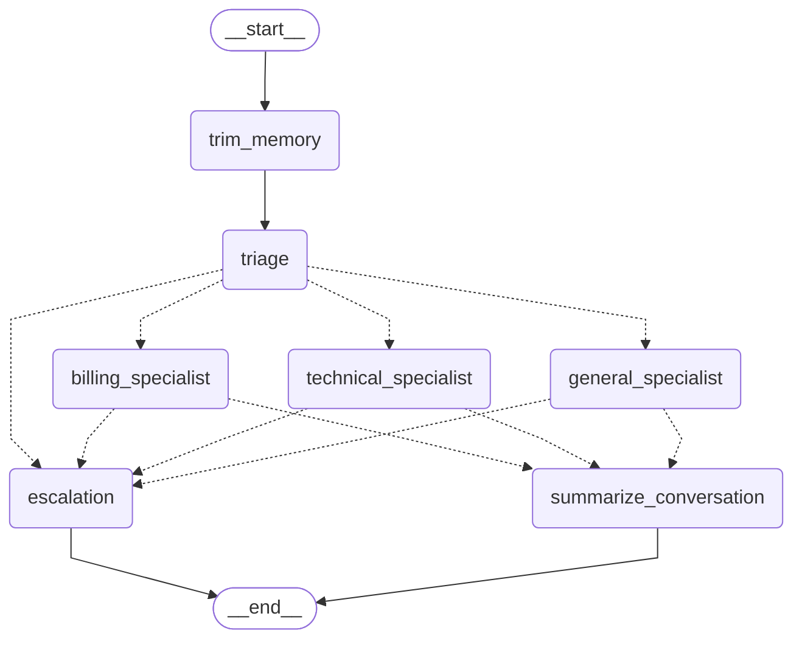
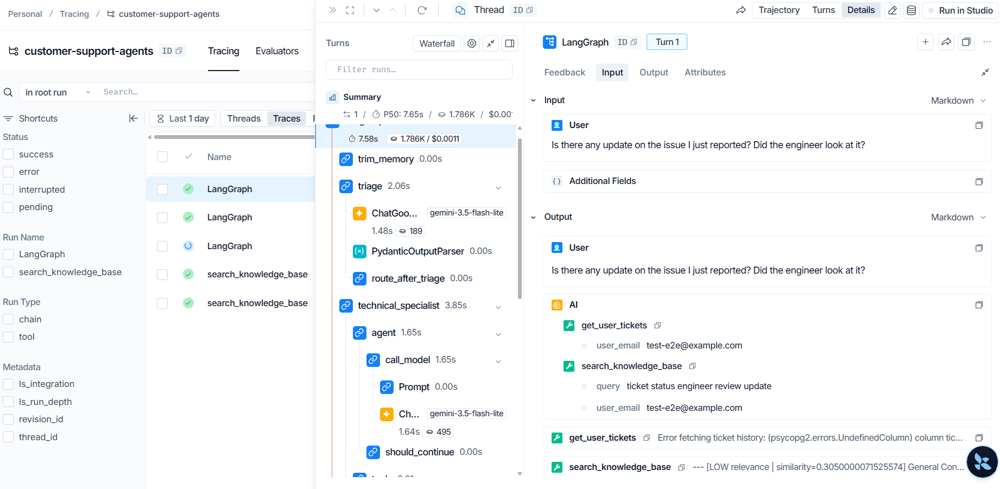
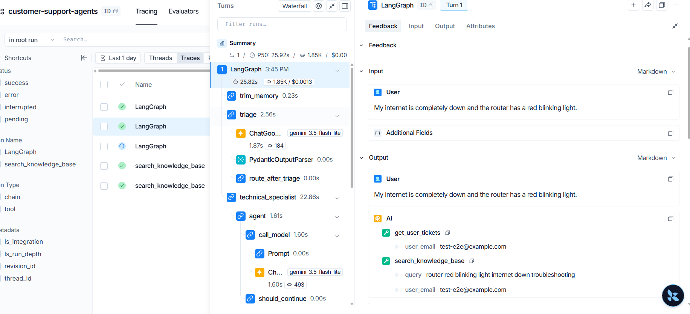
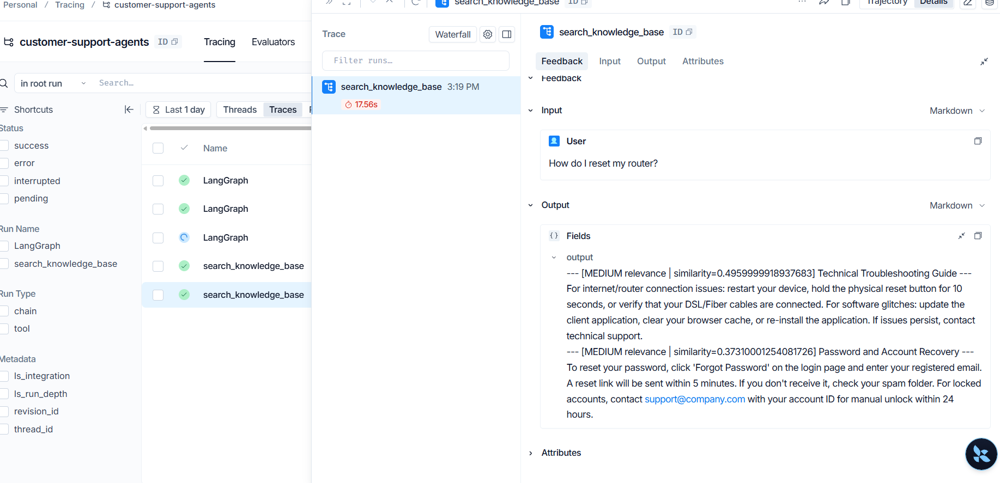

# Multi-Agent Customer Support System 🤖


A production-grade, multi-agent AI customer support backend built with **LangGraph** and **FastAPI**. This system intelligently routes user queries, executes RAG (Retrieval-Augmented Generation) on company policies, remembers long-term user context, and integrates a **Human-in-the-Loop (HITL)** approval flow for sensitive actions (like escalations).

## 🌟 Key Features

- **Multi-Agent Architecture**: 
  - **Triage Agent**: Fast, low-latency intent classification (billing, technical, general).
  - **Specialist Agents**: ReAct-based agents capable of calling tools (fetching ticket history, searching knowledge bases).
- **Human-in-the-Loop (HITL)**: Execution pauses before critical nodes (e.g., Escalation). Supervisors can approve or reject the action via a dedicated API endpoint.
- **Persistent Memory**: Uses PostgreSQL checkpointing to maintain conversation state across sessions and server restarts.
- **Semantic Memory (Long-Term)**: Generates and stores context summaries of past conversations to provide highly personalized support on returning visits.
- **Streaming (SSE)**: Supports Server-Sent Events for real-time token streaming to the frontend.
- **Asynchronous Processing**: Celery & RabbitMQ for processing offline/background tasks.
- **Security & Observability**: 
  - Built-in prompt injection guardrails (rejects attacks and invalid payloads).
  - Token and Cost tracking per conversation.
  - Fully integrated with LangSmith for agent trajectory tracing.

---

## 🏗️ Architecture (LangGraph Output)



---

## 🔍 System in Action (LangSmith Tracing)

The system is fully integrated with LangSmith, providing deep visibility into the agent's thought process, tool execution, and state transitions.

**1. Multi-Agent Routing & Tool Execution:**
Shows the `triage` agent routing to the `technical_specialist`, which then successfully retrieves the user's tickets and queries the knowledge base.



**2. Handling Technical Queries:**
Demonstrates the agent troubleshooting a router issue by executing complex tool calling workflows.



**3. Knowledge Base Retrieval (RAG):**
Detailed view of the `search_knowledge_base` tool output, providing the agent with the necessary troubleshooting steps extracted from company policies.



---

## 🚀 Quick Start (Docker)

You can run the entire infrastructure (API, Celery, Postgres, Redis, RabbitMQ) with a single command.

1. Clone the repository and copy the environment file:
   ```bash
   cp .env.example .env
   ```
2. Add your LLM keys in `.env` (e.g., `GEMINI_API_KEY`, `LANGCHAIN_API_KEY`).
3. Boot the system:
   ```bash
   docker-compose up --build
   ```

The API will be available at: `http://localhost:8000`
Swagger UI Docs: `http://localhost:8000/docs`

---

## 📖 API Usage

### 1. Chat with the Agent (Streaming Support)
Interact with the multi-agent system. State is maintained via `thread_id`.

```bash
curl -X POST http://localhost:8000/api/v1/chat \
  -H "X-API-Key: your_api_key_here" \
  -H "Content-Type: application/json" \
  -d '{
    "thread_id": "user-session-123",
    "user_email": "john@example.com",
    "message": "My internet is completely down."
  }'
```
*(For streaming, use `/api/v1/chat/stream`)*

### 2. Supervisor Approval (HITL)
When the agent attempts to escalate a ticket, it pauses. A supervisor can approve it:

```bash
curl -X POST http://localhost:8000/api/v1/approvals/user-session-123/resolve \
  -H "X-API-Key: your_api_key_here" \
  -H "Content-Type: application/json" \
  -d '{
    "approve": true,
    "feedback": "Approved. Forwarding to Tier 2."
  }'
```

### 3. Token Analytics
Track the total tokens consumed and estimated cost across the system.

```bash
curl -X GET http://localhost:8000/api/v1/stats \
  -H "X-API-Key: your_api_key_here"
```

---

## 🛡️ Testing & QA

The project includes a comprehensive test suite testing Intent Routing, Memory Truncation, Rate Limiting, and Prompt Injection Guardrails.

```bash
pytest tests/ -v
```

An End-to-End integration script is also available to verify the full flow against a live server:
```bash
python e2e_test.py
```

---

## 🧠 Tech Stack
- **Framework:** FastAPI, Python 3.11+
- **AI/LLM:** LangGraph, LangChain, Google Gemini (Customizable to OpenAI/Anthropic)
- **Database:** PostgreSQL (SQLAlchemy ORM) + FAISS (Vector Store)
- **Async & Queues:** Celery, Redis, RabbitMQ
- **Observability:** LangSmith

---
*Built as a showcase for production-ready AI Engineering.*
